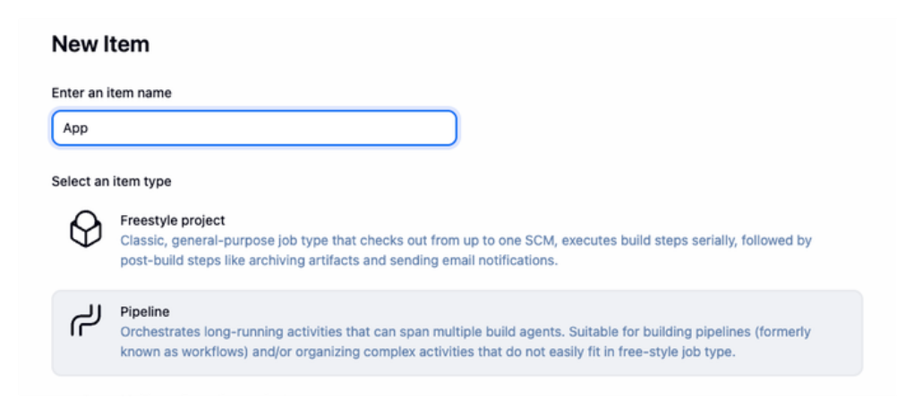
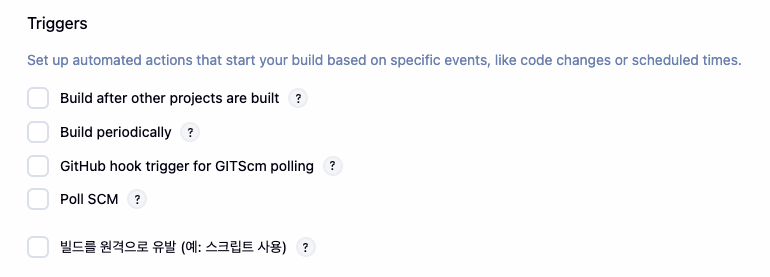
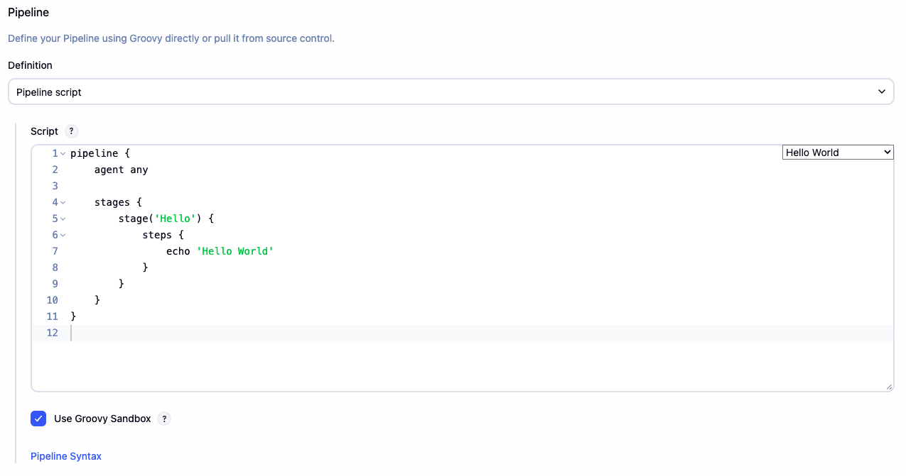
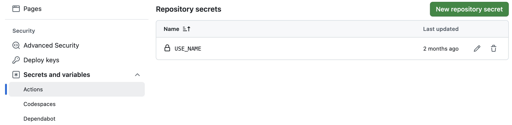

# CI/CD 기초 교육

- [Jenkins 알아보기](https://github.com/ESG-EDU/Docs/tree/main/jenkins)
- [Actions 알아보기](https://github.com/ESG-EDU/Docs/tree/main/github_actions)

## 1. Jenkins 

### Docker Container 만들기

- [`dockerfile`](./jenkins/dockerfile) 설명

| 명령어 | 설명 |
| :---: | :---: |
| `FROM jenkins/jenkins:lts` | Jenkins의 LTS(Long Term Support) 버전을 기본 이미지로 사용 |
| `USER root` | 다음 명령어들을 root 권한으로 실행하기 위해 사용자를 root로 전환 |
| `RUN apt-get update` | 패키지 목록을 최신 상태로 업데이트 |
| `apt-get install -y` | 패키지 설치 시 자동으로 'Yes' 응답 |
| `ca-certificates` | SSL/TLS 인증서 관련 패키지 |
| `curl` | URL을 통해 데이터를 전송하는 도구 |
| `gnupg` | GNU 개인 정보 보호 도구(암호화/서명) | 
| `lsb-release` | 리눅스 배포판 정보 확인 도구 |
| `mkdir -m 0755 -p /etc/apt/keyrings` | 키링 디렉토리 생성 (권한 755) |
| `curl -fsSL ...` | gpg --dearmor |
| `echo "deb [arch=...]"` | Docker 리포지토리 정보 추가 |
| `docker-ce docker-ce-cli containerd.io` | Docker 엔진, CLI, 컨테이너 런타임 설치 |
| `USER jenkins` | 보안을 위해 일반 jenkins 사용자로 전환 | 

- [`compose.yml`](./jenkins/compose.yml) 설명

| 구성요소 | 설명 |
| :---: | :---: |
| `services` | Docker Compose에서 실행할 서비스(컨테이너) 정의 섹션 |
| `service.build` | - context: 현재 디렉토리(.)를 빌드 컨텍스트로 사용<br>- dockerfile: 사용할 Dockerfile 지정 |
| `service.container_name` | 생성될 컨테이너의 이름을 'jenkins'로 지정 |
| `service.ports` | - 9000:8080: Jenkins 웹 인터페이스용 포트 매핑<br> - 50000:50000: Jenkins 에이전트 통신용 포트 |
| `service.volumes` | - jenkins_home:/var/jenkins_home: Jenkins 데이터 영구 저장<br>- /var/run/docker.sock:/var/run/docker.sock: Docker 데몬 접근용 소켓 |
| `service.restart` | unless-stopped: 명시적으로 중지되지 않는 한 항상 재시작 |
| `volumes(최상위)` | jenkins_home: 볼륨 정의 |

- Container 생성

```bash
docker compose up -d
```

- Jenkins 비밀번호 확인

```bash
docker exec jenkins cat /var/jenkins_home/secrets/initialAdminPassword 
```

### Plugin 설치

- `Git Plugin`: GitHub 연동
- `Pipeline Plugin`: Pipelin 작성
- `Docker Pipelin Plugin`: Docker 빌드 및 푸시
- `Amazon ECR Plugin`: AWS ECR 업로드 (AWS 사용 시 필요)

### Item(job) `Pipeline` 만들기



- GitHub WebHooks 사용 시 Triggers 선택



- Pipeline Script 작성



> 예시: 문자열 출력

```groovy
pipeline {
	agent any

	stages {
		stage('Hello') {
			steps {
				echo 'Hello World'
			}
		}
	}
}
```

> 예시: GitHub 저장소 확인

```groovy
pipeline {
	agent any
	environment {
		GITHUB_REPO = "https://github.com/사용자/저장소.git"
	}
	stages {
		stage('Checkout') {
			steps {
				echo "Checking out code from GitHub..."
				git branch: 'main', url: "${GITHUB_REPO}"
			}
		}
	}
	post {
		success {
			echo 'Checkout completed successfully!'
		}
		failure {
			echo 'Checkout failed.'
		}
	}
}
```

## 2. GitHub Actions 

### Workflows 만들기

- `.github/workflows/deploy.yml` 작업 저장소에 파일 생성

> 예시: 문자열 출력

```groovy
name: 연습

on:
  push:
    branches: main

jobs:
	deploy:
		runs-on: ubuntu-latest
		steps:
			- name: 출력하기
				run: echo 'github actions' 
```

> 예시: 내장 변수 출력

```groovy
name: 연습

on:
  push:
    branches: main

jobs:
	deploy:
		runs-on: ubuntu-latest
		steps:
			- name: 내장 변수 출력
				run: |
					echo $GITHUB_SHA
					echo $GITHUB_REPOSITORY
```

> 예시: Actions Secrets 변수 출력



```groovy
name: 연습

on:
  push:
    branches: main

jobs:
	deploy:
		runs-on: ubuntu-latest
		steps:
			- name: 시크릿 변수 출력
				run: |
					echo ${{ secrets.USE_NAME }}
```

> 예시: Script 실행

```groovy
name: 연습

on:
  push:
    branches: main

jobs:
	deploy:
		runs-on: ubuntu-latest
		steps:
      - name: 저장소 확인
        uses: actions/checkout@v3

      - name: Add execute permission
        run: chmod +x ./scripts/run.sh
        
      - name: 스크립트 실행
        run: ./scripts/run.sh
```

Shell Script 파일 실행 시 `실행 권한`이 필수 입니다.

> 예시: Python 실행

```groovy
name: 연습

on:
  push:
    branches: main

jobs:
	deploy:
		runs-on: ubuntu-latest
		steps:
      - name: 저장소 확인
        uses: actions/checkout@v3

      - name: Python 환경 설정
        uses: actions/setup-python@v5
        with:
          python-version: "3.14"

      - name: Install dependencies
        run: |
          pip install --upgrade pip
          pip install -r requirements.txt

      - name: Run python
        run: python src/app.py
```
